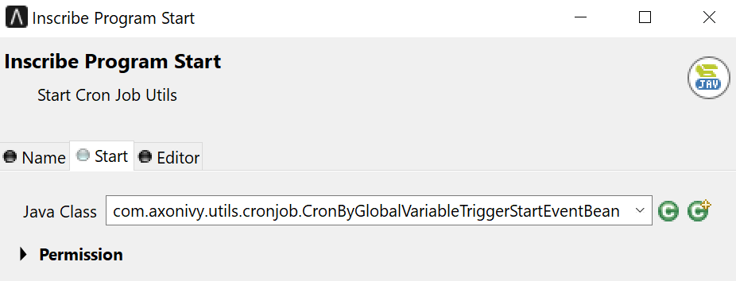

# Cron Job

Ein Cron Job ist ein wiederkehrender Zeitplan zur Ausführung von Aufgaben. Mit einem Cron Job kannst Du Zeitpläne wie „jeden Freitag um 12 Uhr“, „jeden Wochentag um 9:30 Uhr“ oder sogar „alle 5 Minuten zwischen 9:00 und 10:00 Uhr an jedem Montag, Mittwoch und Freitag im Januar“ festlegen.

Das [Quartz-Framework](http://www.quartz-scheduler.org/) wird als zugrunde liegendes Scheduler-Framework verwendet.

Mehr Details zu Cron-Expressions kannst Du z.B. hier finden: [Lesson 6: CronTrigger](http://www.quartz-scheduler.org/documentation/quartz-2.3.0/tutorials/tutorial-lesson-06.html)

## Demo

In dieser Demo ist die `CronByGlobalVariableTriggerStartEventBean` als die Java-Klasse definiert, die im Ivy Program Start-Element ausgeführt wird.



Diese Bean erhält eine Cron-Expression über die als Cron-Expression definierte Variable und plant die Ausführung basierend auf dieser Expression.


In dieser Demo legt die Cron-Expression die Startzeit des Cron-Jobs fest, der einfach alle 5 Sekunden ausgeführt wird.

```
demoStartCronPattern: 0/5 * * * * ?
```

## Setup

Für diese Demo ist keine besondere Einrichtung erforderlich. Starte einfach die Engine und beobachte das Logging, das alle 5 Sekunden mit folgendem Eintrag aktualisiert wird:

```
Cron Job ist gestartet am: 2023-01-27 10:43:20.
```
